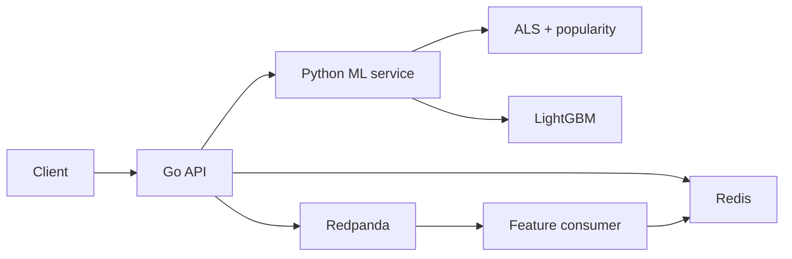

# PulseRank

A real-time personalized recommendation platform: user interactions stream through Kafka-compatible Redpanda, update online features in Redis, and change the next recommendations from a two-stage retrieval + ranking system.

This is a portfolio project for backend, ML, and ML-systems interviews. It is **not** a Google/Netflix-scale production clone.

## Demo

```bash
python scripts/download_data.py
python scripts/prepare_data.py
python scripts/train.py
python scripts/evaluate.py
docker compose up -d --build
python scripts/seed_online_features.py
python scripts/demo_realtime_personalization.py 1001
```

The last script prints **measured** before/after category affinities. On this machine, user `1001` went from sci-fi affinity **0.31 → 0.64** after a burst of likes. The top-10 sci-fi *count* did not have to jump: ranking can only reorder the ALS candidate set. That constraint is the point of two-stage retrieval.

UI (after compose): [http://localhost:3000](http://localhost:3000)

## Why I built it

Production recommenders are a feedback loop, not a `fit()` call:

- events are delayed, duplicated, and malformed
- features used at train time must mean the same thing at serve time
- retrieval and ranking are different systems
- models fail; the API should degrade instead of 500
- quality claims need temporal evaluation, not a shuffled test set

PulseRank is small enough to run on a laptop and still force those problems to be explicit.

## Architecture



Details: [docs/ARCHITECTURE.md](docs/ARCHITECTURE.md)

## How recommendations work

1. **Candidates** (~100): popularity (cold start / fallback) and ALS collaborative filtering.
2. **Ranker**: LightGBM LambdaMART on ~21 features (retrieval score, user windows, item stats, category affinity, …).
3. **Filter**: drop duplicates and disliked items.
4. Return top 10.

A/B: half of users (stable hash) see retrieval order; half see the learned ranker.

## Real-time feedback loop

```
like / skip → POST /v1/events → Redpanda → feature consumer
    → Redis user features → next GET /v1/recommendations
```

Same `FeatureEngine` offline and online. See [docs/TRAINING_SERVING_PARITY.md](docs/TRAINING_SERVING_PARITY.md).

## Reliability

- Per-dependency timeouts and `context.Context`
- Ranker / candidate / Redis fallbacks with `fallback_used`
- At-least-once consumption + Redis `event_id` idempotency (not exactly-once)
- Invalid events → `events.dead-letter`

## ML evaluation

Measured on MovieLens 1M with a **temporal** split (earliest 80% train / 10% val / 10% test), 400 test users. Full table: [reports/offline_evaluation.md](reports/offline_evaluation.md).

| Method | NDCG@10 | HitRate@10 | MRR |
|---|---:|---:|---:|
| random | 0.010 | 0.093 | 0.027 |
| popularity | 0.103 | 0.455 | 0.183 |
| ALS | 0.141 | 0.545 | 0.269 |
| ALS + ranker | 0.165 | 0.628 | 0.295 |

Candidate Recall@100: popularity 0.203 vs ALS 0.253.

These numbers came from `python scripts/evaluate.py`. They are not claims about production traffic.

## System benchmarks

Measured on this Windows laptop against a local Go API + Python ML service. Full table: [reports/BENCHMARKS.md](reports/BENCHMARKS.md).

| Concurrency | RPS | p50 | p95 | p99 |
|---:|---:|---:|---:|---:|
| 1 | 37 | 31 ms | 35 ms | 68 ms |
| 10 | 112 | 83 ms | 109 ms | 118 ms |

200 interaction events: ~38 publish/sec, 200/200 applied by the consumer (~18/sec end-to-end on this machine).

Not a production capacity claim.

## A/B experimentation

`sha256(experiment_id + ":" + user_id) % 100` — deterministic, no process RNG. Impression events carry `experiment` and `model_version`.

## Running locally

Requires Python 3.12+, Go 1.24+, Docker.

```bash
python -m pip install -e ".[dev]"
python scripts/download_data.py
python scripts/prepare_data.py
python scripts/train.py
python scripts/evaluate.py
docker compose up -d --build
python scripts/seed_online_features.py
curl http://localhost:8080/v1/recommendations/1001?limit=10
```

Makefile targets: `setup`, `download-data`, `prepare-data`, `train`, `evaluate`, `up`, `down`, `test`, `lint`, `demo`, `benchmark`.

## Technical tradeoffs

[docs/TRADEOFFS.md](docs/TRADEOFFS.md) — Redpanda vs Kafka, Redis blobs vs a feature store, SET-before-write dedupe, uniform negatives, ALS on a laptop.

## Limitations

- MovieLens ratings are not feed impressions; like/skip is a mapping.
- Ranker training uses a subset of users for runtime.
- Dedupe TTL is 7 days.
- No Kubernetes, no Spark, no feature-store product.
- Metrics in `reports/` are only valid after the generating command has been run.

## Repository map

- `cmd/recommendation-api` — Go HTTP
- `internal/` — orchestration, experiments, events, telemetry
- `services/ml_service` — FastAPI retrieval + rank
- `services/feature_consumer` — stream → Redis
- `pulserank_ml/` — data, features, ALS, ranker, metrics
- `tests/parity/` — offline/online feature equality
- `web/` — Next.js demo UI
