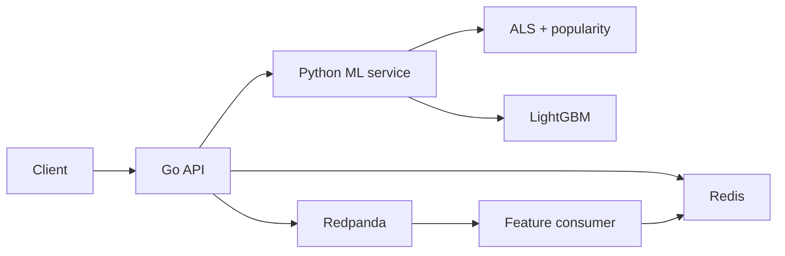

# Watch Next

Like or skip a movie, and the **next ranking updates immediately**.

A small real-time recommendation platform: a **Go** HTTP API streams interactions through Kafka-compatible **Redpanda**, updates **Redis** online features, and serves a two-stage **ALS retrieval + LightGBM ranker**. Movies are the demo catalog. The serving path is the point.

**Demo:** [watch-next-cyan.vercel.app](https://watch-next-cyan.vercel.app/) · **Local UI:** [localhost:3000](http://localhost:3000) · **API:** `GET /v1/recommendations/{user_id}`

`Go` · `Python` · `Redis` · `Redpanda` · `LightGBM` · `Prometheus` · `Docker`

## Serving path



1. Stable-hash the user into an experiment variant.
2. Load online features from Redis (timeout).
3. Retrieve ~100 candidates (ALS + popularity; popularity alone on cold start).
4. Rank with LightGBM (treatment) or keep retrieval order (control).
5. Filter duplicates, liked/skipped titles, and optional genre.
6. Return the bill; publish the impression asynchronously.

Later feedback:

```
POST /v1/events → Redpanda → feature consumer → Redis → next GET /v1/recommendations
```

Go owns deadlines, cancellation, experiment assignment, and fallbacks. Python owns ALS, LightGBM, and the shared feature engine. Delivery is **at-least-once** with **idempotent** consumers — not exactly-once.

[Architecture](docs/ARCHITECTURE.md) · [Event pipeline](docs/EVENT_PIPELINE.md) · [Recommendation system](docs/RECOMMENDATION_SYSTEM.md) · [Features](docs/FEATURES.md) · [Failure handling](docs/FAILURE_HANDLING.md) · [Tradeoffs](docs/TRADEOFFS.md)

## What is implemented

- **Two-stage ranking** — ALS + popularity retrieve; LightGBM LambdaMART re-ranks on 21 features (retrieval score, user windows, item stats, category affinity)
- **Online features** — likes/skips update Redis before the next request; EMA category affinity plus 24h/7d windows
- **Training–serving parity** — the same `FeatureEngine` builds offline ranker rows and applies stream updates
- **Experiments** — SHA-256 assignment; impressions carry `experiment` and `model_version`; optional shadow ranking on control traffic
- **Degradation** — per-dependency timeouts; ranker / candidate / Redis fallbacks; HTTP 503 if an event never reaches the log; dead-letter for invalid payloads
- **Idempotent streaming** — Redis `SET NX` on `event_id` so Redpanda replays do not double-count
- **Observability** — Prometheus metrics and Grafana dashboards (latency, fallbacks, freshness, events)
- **Catalog** — MovieLens 1M plus later titles; browse, search, and genre filter

## Evaluation

MovieLens 1M, **temporal** split (80% train / 10% val / 10% test), 400 test users. Ranker features use only history before time *t*. Full report: [reports/offline_evaluation.md](reports/offline_evaluation.md).

| Method | NDCG@10 | HitRate@10 | MRR |
|---|---:|---:|---:|
| random | 0.010 | 0.093 | 0.027 |
| popularity | 0.103 | 0.455 | 0.183 |
| ALS | 0.141 | 0.545 | 0.269 |
| ALS + ranker | **0.165** | **0.628** | **0.295** |

Candidate Recall@100: popularity 0.203 → ALS 0.253.

## Local serving

Measured on a laptop against the Compose stack. Not a capacity claim. Full table: [reports/BENCHMARKS.md](reports/BENCHMARKS.md).

| Concurrency | RPS | p50 | p95 | p99 |
|---:|---:|---:|---:|---:|
| 1 | 37 | 31 ms | 35 ms | 68 ms |
| 10 | 112 | 83 ms | 109 ms | 118 ms |

Timeouts: Redis 80ms, candidates 800ms, ranker 1.5s, request 2.5s. Tests cover fallbacks, schema, experiment assignment, temporal leakage, idempotency, and feature parity. CI runs `go test -race`, pytest, ruff, and mypy.

## Quick start

Requires Python 3.12+, Go 1.24+, Docker.

```bash
python -m pip install -e ".[dev]"
python scripts/download_data.py
python scripts/prepare_data.py
python scripts/train.py
python scripts/evaluate.py
docker compose up -d --build
python scripts/seed_online_features.py
curl http://localhost:8080/v1/recommendations/1001?limit=10
python scripts/demo_realtime_personalization.py 1001
```

Makefile: `setup`, `download-data`, `prepare-data`, `train`, `evaluate`, `up`, `down`, `test`, `lint`, `demo`, `benchmark`.

## Hosted demo

The UI is on [Vercel](https://watch-next-cyan.vercel.app/). The API is a Render Docker service (Go + Python ranker + Redis). Render’s free tier **spins down after 15 minutes idle**, so the first click after that can take about a minute.

The hosted API sets `INLINE_FEATURES=true` and skips Kafka so likes still update Redis on one small VM. The Compose stack is the full path (Redpanda + feature consumer).

To redeploy: Render web service from this repo (Docker, health check `/health`), Vercel project with root `web` and `NEXT_PUBLIC_API_URL` pointing at the Render URL.

## Repository

| Path | Role |
|---|---|
| `cmd/recommendation-api` | Go HTTP API: orchestration, timeouts, experiments, events |
| `internal/` | Recommendation flow, Redis, Kafka publish, telemetry |
| `services/ml_service` | Candidate retrieval + ranker inference |
| `services/feature_consumer` | Stream → Redis features, dedupe, dead-letter |
| `watchnext/` | Data, shared feature engine, ALS, ranker, metrics |
| `web/` | Next.js demo UI |
| `tests/parity/` | Offline / online feature equality |
| `observability/` | Prometheus + Grafana |
