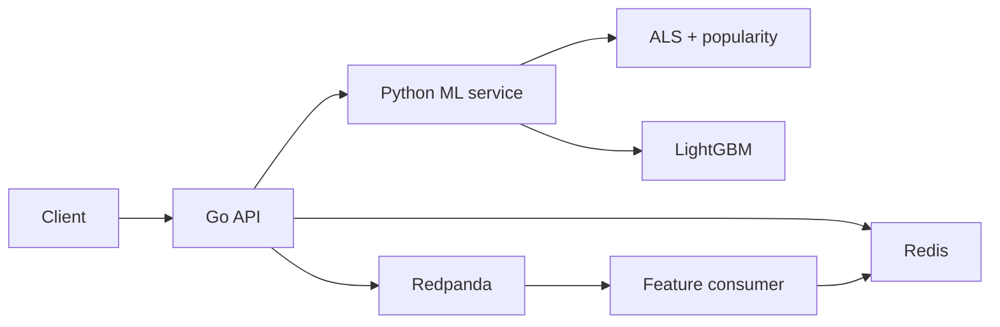

# Watch Next

What to watch next, from the movies you just liked or skipped. Likes and skips stream through Kafka-compatible Redpanda, update online features in Redis, and immediately change the next ranking from a two-stage retrieval + ranker.

**UI:** [http://localhost:3000](http://localhost:3000) · **Browse:** [http://localhost:3000/browse](http://localhost:3000/browse) · **API:** `GET /v1/recommendations/{user_id}`

## Features

- **Two-stage ranking** — ALS + popularity retrieve candidates; LightGBM LambdaMART re-ranks on ~21 features (retrieval score, user windows, item stats, category affinity)
- **Full catalog** — MovieLens 1M plus IMDb’s daily dump, so the house runs through the current year. Browse, search, and filter by genre. Refresh titles from Booth.
- **Live feedback loop** — like / skip events update Redis user features before the next request
- **Training–serving parity** — the same `FeatureEngine` runs offline and online
- **A/B experiments** — stable hash assignment; impressions carry `experiment` and `model_version`
- **Graceful degradation** — per-dependency timeouts, ranker / candidate / Redis fallbacks, dead-letter for invalid events
- **Idempotent streaming** — at-least-once consumption with Redis `event_id` dedupe
- **Observability** — Prometheus metrics, Grafana dashboards, OpenTelemetry traces

## Architecture



[Architecture](docs/ARCHITECTURE.md) · [Event pipeline](docs/EVENT_PIPELINE.md) · [Recommendation system](docs/RECOMMENDATION_SYSTEM.md) · [Features](docs/FEATURES.md)

## How it works

1. Assign the user to an experiment variant.
2. Load online features from Redis.
3. Retrieve candidates (ALS + popularity).
4. Rank with LightGBM (treatment) or retrieval order (control).
5. Filter duplicates, skips, and optional genre; return a longer bill (default 36).
6. Publish the impression; later likes/skips flow:

```
POST /v1/events → Redpanda → feature consumer → Redis → next GET /v1/recommendations
```

## Evaluation

MovieLens 1M, temporal split (80% train / 10% val / 10% test), 400 test users. Full report: [reports/offline_evaluation.md](reports/offline_evaluation.md).

| Method | NDCG@10 | HitRate@10 | MRR |
|---|---:|---:|---:|
| random | 0.010 | 0.093 | 0.027 |
| popularity | 0.103 | 0.455 | 0.183 |
| ALS | 0.141 | 0.545 | 0.269 |
| ALS + ranker | **0.165** | **0.628** | **0.295** |

Candidate Recall@100: popularity 0.203 → ALS 0.253.

## Performance

| Concurrency | RPS | p50 | p95 | p99 |
|---:|---:|---:|---:|---:|
| 1 | 37 | 31 ms | 35 ms | 68 ms |
| 10 | 112 | 83 ms | 109 ms | 118 ms |

Full table: [reports/BENCHMARKS.md](reports/BENCHMARKS.md).

## Quick start

Requires Python 3.12+, Go 1.24+, Docker.

```bash
python -m pip install -e ".[dev]"
python scripts/download_data.py
python scripts/prepare_data.py
python scripts/train.py
python scripts/evaluate.py
docker compose up -d --build
python scripts/seed_online_features.py
curl http://localhost:8080/v1/recommendations/1001?limit=10
python scripts/demo_realtime_personalization.py 1001
```

Makefile: `setup`, `download-data`, `prepare-data`, `train`, `evaluate`, `up`, `down`, `test`, `lint`, `demo`, `benchmark`.

## Live demo (Render + Vercel)

The UI is a free **Vercel** Next.js app. The API is a free **Render** Docker web service (Go + Python ranker + Redis). Render’s free tier **spins down after 15 minutes of idle**, so the first click after that can take about a minute.

1. Push this repo to GitHub, then on [render.com](https://render.com) create a **Web Service** from the repo: Docker, **Free**, health check `/health`. Copy the `onrender.com` URL.
2. On [vercel.com](https://vercel.com) import the same repo, set **Root Directory** to `web`, and add `NEXT_PUBLIC_API_URL` = that Render URL (no trailing slash). Redeploy after saving the env var.
3. Put the Vercel URL in the GitHub repo **About → Website**.

The hosted API skips Kafka (`INLINE_FEATURES=true`) so likes still update Redis on one small VM. 512 MB RAM is tight; if the service OOMs, check Render logs.

## Repository

| Path | Role |
|---|---|
| `cmd/recommendation-api` | Go HTTP API |
| `internal/` | Orchestration, experiments, events, telemetry |
| `services/ml_service` | Candidate retrieval + ranking |
| `services/feature_consumer` | Stream → Redis features |
| `watchnext/` | Data, features, ALS, ranker, metrics |
| `web/` | Next.js UI |
| `tests/parity/` | Offline / online feature equality |
