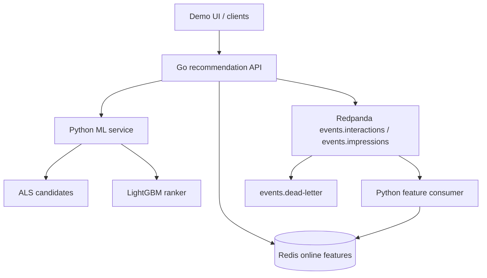

# Architecture

PulseRank is a small real-time recommendation platform, not a clone of a production feed at Google-scale.

## Components

| Process | Role |
|---|---|
| `recommendation-api` | Public HTTP, timeouts, experiment assignment, fallbacks, impression publish |
| `ml_service` | Candidate retrieval + ranker inference |
| `feature_consumer` | At-least-once consume, idempotent Redis updates, dead-letter |
| Redis | Low-latency user feature blobs |
| Redpanda | Kafka-compatible log |

Offline training (`scripts/train.py`, `scripts/evaluate.py`) is batch Python. It is not a service.

## Request path

1. Assign experiment with `sha256(experiment_id + ":" + user_id) % 100`.
2. Load `user:{id}:features` from Redis (timeout).
3. `POST /internal/candidates` (~100 items).
4. Treatment: `POST /internal/rank`. Control: sort by retrieval score.
5. Filter duplicates and disliked items.
6. Return top-K.
7. Publish impression asynchronously.

## Why this split

Go is the right place for deadlines, cancellation, and orchestration.
Python is the right place for ALS, LightGBM, and the shared feature engine.

If this diagram stops matching the one-sentence explanation in the README, the architecture has gone too far.
